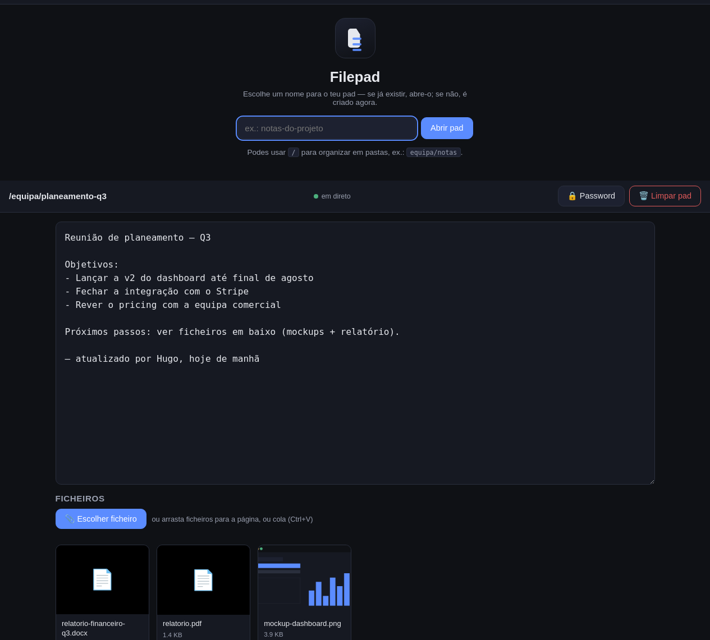
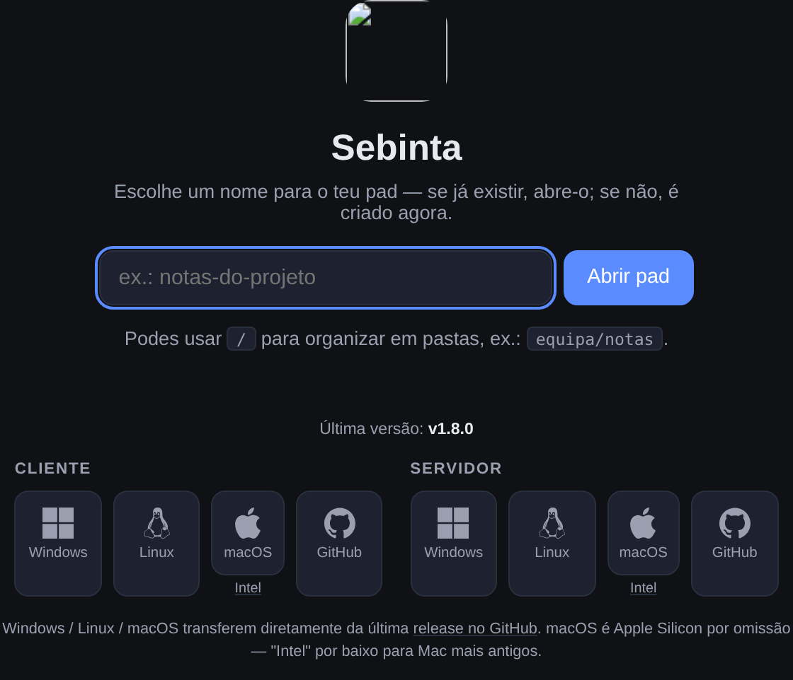
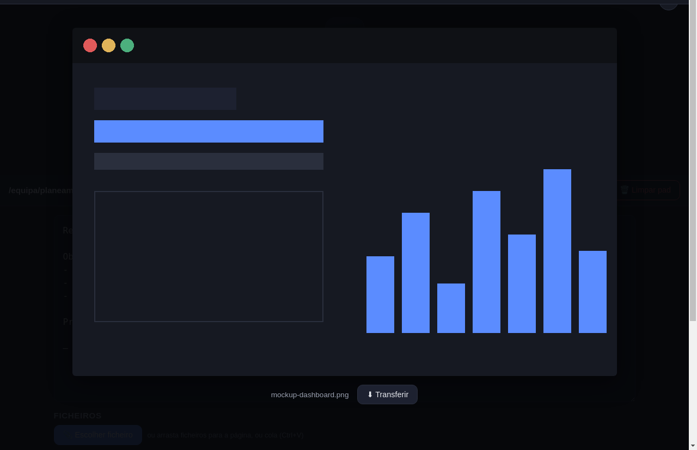
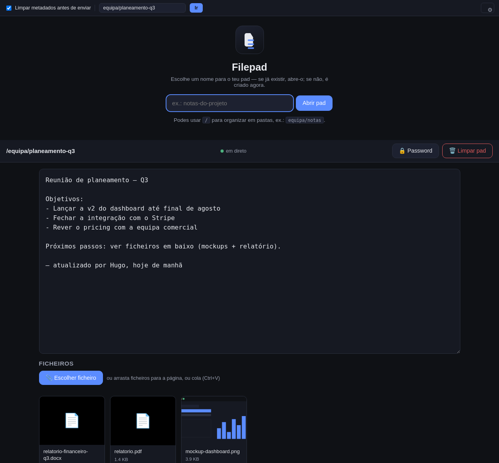

<p align="center">
  
</p>

<h1 align="center">Sebinta</h1>

<p align="center">
  A Dontpad-style pad for text and files. Open a URL, start typing, drop a file — that's it.
</p>

<p align="center">
  
</p>

No accounts, no login, no user database. Open `https://yourdomain.com/whatever-you-want` and the pad is created — or opened, if it already exists. Anyone with the link can read and write it, same as Dontpad. Autosaved text, drag-and-drop uploads, and near-real-time sync between every device that has the same pad open.

Runs three different ways depending on what you want: a Docker deployment behind a Cloudflare tunnel, a single dependency-free Go binary, or an Electron desktop client. Pick whichever fits — see [Getting started](#getting-started).

## Contents

- [Features](#features)
- [Screenshots](#screenshots)
- [Getting started](#getting-started)
  - [Option A — Docker](#option-a--docker-persistent-server-behind-a-cloudflare-tunnel)
  - [Option B — Standalone binary](#option-b--standalone-binary-no-docker)
  - [Option C — Desktop app](#option-c--desktop-app)
- [Metadata cleaning](#metadata-cleaning)
- [Setting up the Cloudflare tunnel](#setting-up-the-cloudflare-tunnel)
- [Configuration reference](#configuration-reference)
- [Managing a Docker deployment](#managing-a-docker-deployment)
- [Project structure](#project-structure)
- [Design decisions](#design-decisions)
- [Troubleshooting](#troubleshooting)

## Features

- **Implicit pad creation** — any URL path is a valid pad. Text autosaves as you type (debounced), no save button.
- **Near-real-time sync** over WebSocket, with automatic fallback to short-interval polling if the socket can't connect (e.g. a proxy that blocks upgrades).
- **Uploads** by button, drag-and-drop, or paste (Ctrl+V). Images get an inline thumbnail and open full-size in an in-page lightbox before you download; everything else lists with name, size, download, and delete.
- **Nested pads** — `team/notes` works as a pad name, so you can organize with folders if you want to.
- Configurable per-file size limit, upload progress bar, and optional automatic cleanup of old files (TTL).
- Optional site-wide password, and an independent optional password per pad.
- Real type validation by magic bytes (not by extension or declared MIME type), randomized on-disk filenames, CSRF protection, rate limiting, a restrictive CSP with no external CDNs, and text always escaped on render.
- The server itself does **not** strip file metadata — see [Metadata cleaning](#metadata-cleaning) if you need that guarantee before a file leaves your machine.

## Screenshots

|                                                                       |                                                                            |
| :-------------------------------------------------------------------: | :-------------------------------------------------------------------------: |
|   |                  |
| Open the root URL with no pad name and it asks you to pick one, instead of erroring | Click an image thumbnail to preview it full-size before downloading |

<p align="center">
  
  <br>
  <sub>The desktop client — literally the same page as the browser, with a thin toolbar bolted on for local metadata cleaning.</sub>
</p>

## Getting started

Three independent ways to run Sebinta. They all speak the same HTTP API and (for the server variants) the same SQLite schema, so you can mix and match.

### Option A — Docker (persistent server behind a Cloudflare tunnel)

The way to run this as a real, always-on service. Needs Docker and a domain on Cloudflare.

```bash
cp .env.example .env
# fill in TUNNEL_TOKEN — see "Setting up the Cloudflare tunnel" below
./start.sh
```

`start.sh` builds the image, brings up the `app` and `cloudflared` containers, waits for them to be healthy, and prints the URL your pad is reachable at. Full walkthrough (including the Cloudflare tunnel setup) below.

### Option B — Standalone binary (no Docker)

A single static Go binary with **`cloudflared` embedded** — nothing else to install. Grab it from [Releases](/RampGamer/sebinta/releases) and run it:

```bash
./sebinta-server-linux-amd64
```

That's the whole setup. It starts the server, opens a Cloudflare Quick Tunnel by itself, and prints the public URL in **bold cyan** as soon as it's ready:

```
2026/08/05 23:28:13  Sebinta available at: https://random-words-here.trycloudflare.com
```

Set `DISABLE_TUNNEL=true` to stay local-only, or `TUNNEL_TOKEN` to use a fixed domain instead of the random one. Full details, including how to build it yourself and cross-compile for other platforms, in [`standalone/README.md`](standalone/README.md).

### Option C — Desktop app

An Electron client that opens your Sebinta server in a normal window — same interface as the browser — and additionally intercepts uploads to clean Office/PDF metadata locally before they leave your computer (see [Metadata cleaning](#metadata-cleaning)). Available for Linux (AppImage), Windows (portable `.exe`, no installer), and macOS (Intel + Apple Silicon) from [Releases](/RampGamer/sebinta/releases).

The first launch asks for your server's URL and remembers it — after that, it's just open and use. Details in [`desktop/README.md`](desktop/README.md).

## Metadata cleaning

The server and the web page **do not strip metadata** — a file is stored exactly as it was received. If you need to make sure a document doesn't carry an author name, company, GPS coordinates, or a DLP classification tag (Titus, Microsoft Purview, etc.) when you share it, clean it **before** upload with one of these:

- **Desktop app** (`desktop/`) — cleans Office documents (`.docx`/`.xlsx`/`.pptx`, including Custom XML DLP parts) and PDFs locally before upload. Cleaning is optional, except when DLP tags are detected in an Office document — then it's always applied, regardless of the toggle. See [`desktop/README.md`](desktop/README.md).
- **CLI** (`cli/`) — `sebinta-clean`, a dependency-free Go tool to clean (and optionally upload) Office documents from a terminal or a script. See [`cli/README.md`](cli/README.md).

Other file types (images, video, audio, legacy Office `.doc`/`.xls`/`.ppt`) upload without any cleaning — neither tool covers those formats today.

## Setting up the Cloudflare tunnel

Only needed if you want a fixed domain (Option A, or Option B/C with `TUNNEL_TOKEN`). Skip this entirely if a random `*.trycloudflare.com` link is fine for your use case — the standalone binary and `docker-compose.yml`'s default already do that with zero configuration.

1. Open the [Cloudflare dashboard](https://dash.cloudflare.com) → **Zero Trust** (first time in, it'll ask you to pick a team name — anything works, it's just a dashboard label).
2. **Networks → Tunnels → Create a tunnel.**
3. Connector type **Cloudflared**, give the tunnel a name (e.g. `sebinta`).
4. On **"Install and run a connector"**, Cloudflare shows a command with a long `--token eyJ...` value. **Copy just the token** — that's what goes into `.env` as `TUNNEL_TOKEN`. You don't need to run that command yourself; `docker-compose.yml` (or the standalone binary) already runs `cloudflared` for you.
5. Continue to **Route traffic / Public Hostname**:
   - **Subdomain**: whatever you want (e.g. `notes`), or leave empty to use the root domain.
   - **Domain**: pick the domain you already have on Cloudflare.
   - **Service**: type `HTTP`, address:
     - Docker: `app:3000` — the Docker service name, resolved over the internal Docker network. **Don't use `localhost` or an IP** — `cloudflared` runs inside the Docker network, not on your machine.
     - Standalone binary: `localhost:3000` (or whatever `PORT` you set).
6. Save. Within a few seconds the public hostname (e.g. `https://notes.yourdomain.com`) is associated with the tunnel.

HTTPS is handled entirely by Cloudflare — your app never needs certificates or open ports.

For Docker, after getting the token: `cp .env.example .env`, fill in `TUNNEL_TOKEN`, and switch the `command` line for the `cloudflared` service in `docker-compose.yml` from the Quick Tunnel default to `["tunnel", "run"]` (already commented in the file, right above that line).

## Configuration reference

Same environment variables across Docker and the standalone binary (`.env` in the project root, or a `.env` file next to the standalone binary).

| Variable | Required | Default | Description |
|---|---|---|---|
| `TUNNEL_TOKEN` | For a fixed domain | — | Cloudflare named-tunnel token. Without it, both Docker and the standalone binary fall back to a random Quick Tunnel link. |
| `SITE_PASSWORD` | No | empty (open site) | Site-wide password |
| `MAX_FILE_SIZE_MB` | No | `500` | Per-file size limit |
| `FILE_TTL_DAYS` | No | empty (disabled) | Auto-delete files older than N days |
| `COOKIE_SECRET` | Recommended | random on startup | Signs session cookies — set a fixed value so sessions survive restarts |
| `COOKIE_SECURE` | No | `true` | Only turn off for local HTTP testing without a tunnel |
| `DISABLE_TUNNEL` | No (standalone only) | `false` | `true` to run local-only, no Cloudflare tunnel at all |
| `LOG_FILE` | No (standalone only) | `DATA_DIR/sebinta.log` | Where logs are persisted, in addition to stdout |

## Managing a Docker deployment

```bash
# Stop (keeps the data volumes)
docker compose down

# Restart
docker compose up -d

# Restart just one service
docker compose restart app

# Live logs
docker compose logs -f

# Health check — should show "healthy" for the app service
docker compose ps
```

**Updating:**

```bash
git pull
docker compose build app
docker compose up -d
```

To bump just the `cloudflared` image: `docker compose pull cloudflared && docker compose up -d cloudflared`.

**Backup and restore** — data lives in two named Docker volumes, `sebinta_data` (SQLite database) and `sebinta_uploads` (files). Confirm the exact names with `docker volume ls | grep sebinta` (they're prefixed with the project folder name).

```bash
# Backup
mkdir -p backups
docker run --rm \
  -v sebinta_sebinta_data:/data \
  -v sebinta_sebinta_uploads:/uploads \
  -v "$(pwd)/backups":/backup \
  alpine tar czf /backup/sebinta-backup-$(date +%Y%m%d-%H%M%S).tar.gz -C / data uploads

# Restore
docker compose down
docker run --rm \
  -v sebinta_sebinta_data:/data \
  -v sebinta_sebinta_uploads:/uploads \
  -v "$(pwd)/backups":/backup \
  alpine sh -c "cd / && tar xzf /backup/sebinta-backup-XXXXXXXX-XXXXXX.tar.gz"
docker compose up -d
```

## Project structure

```
sebinta/
├── docker-compose.yml   # app + cloudflared services
├── Dockerfile             # Node app image
├── start.sh                # docker compose up + prints the tunnel URL
├── .env.example
├── server/                  # Node/Express server (the Docker deployment)
│   ├── index.js               # bootstrap: HTTP + WebSocket
│   ├── auth.js                  # site password, pad password, CSRF
│   ├── ws.js                      # real-time sync
│   ├── middleware/                 # security headers, rate limiting
│   ├── routes/                      # /api/auth, /api/pad, /api/files
│   └── services/                     # DB access, storage, magic-byte sniffing, TTL cleanup
├── public/                  # frontend — shared by server/ and standalone/
│   ├── pad.html / login.html
│   ├── css/style.css
│   └── js/app.js, upload.js
├── standalone/               # server rewritten in Go — single binary, no Docker
├── desktop/                   # Electron client with local metadata cleaning
└── cli/                         # sebinta-clean: Go CLI for scripted uploads
```

Each of `standalone/`, `desktop/`, and `cli/` has its own `README.md` with build instructions and details specific to that component.

## Design decisions

- **Pad IDs can contain `/`, so file/password endpoints use `?id=`, not a path segment.** Any URL path (slashes included) is a valid pad, so the files/password endpoints take `?id=` (and the WebSocket takes `?pad=`) instead of embedding it in their own path — avoids ambiguity between "a pad named `notes/files`" and "the files endpoint for the pad `notes`".
- **No metadata cleaning on the server or the web page.** Sebinta stores files as received. Anyone who needs that guarantee does the cleaning before upload, with the [desktop app or CLI](#metadata-cleaning) — keeps the server simple and free of heavy dependencies (`exiftool`/`ffmpeg`).
- **Cookie-based sessions, no user database.** Keeps the project simple — no session table, nothing to expire. The cost: changing `COOKIE_SECRET` (or not fixing it, so a restart generates a new one) invalidates every session, including unlocked pad passwords. Set a fixed `COOKIE_SECRET` to avoid that.
- **Per-pad password lives in a signed cookie, not a server-side session.** Same reasoning — no session table. "Unlocking" a pad is local to the browser that unlocked it.
- **The standalone Go server embeds the official `cloudflared` binary rather than linking it as a library.** `cloudflared`'s entry point is `package main`, which Go can't import, and its internal packages (`supervisor`, `orchestration`, ...) aren't a stable public API meant for external reuse. Embedding the real binary via `go:embed` and running it as a subprocess gets the same "nothing to install" result without depending on undocumented internals.

## Troubleshooting

**The tunnel shows "inactive" on the Cloudflare dashboard.**
Check that `TUNNEL_TOKEN` in `.env` is correct and has no stray whitespace, then `docker compose up -d cloudflared` and `docker compose logs cloudflared`.

**The app never becomes "healthy" (Docker).**
`docker compose logs app` — the healthcheck runs `curl http://127.0.0.1:3000/health` inside the container; a failure usually means a startup error (check the logs) or no disk space left for the database.

**I want to turn the site password back off.**
Clear `SITE_PASSWORD` in `.env` and run `docker compose up -d app` (or restart the standalone binary with the variable unset).
